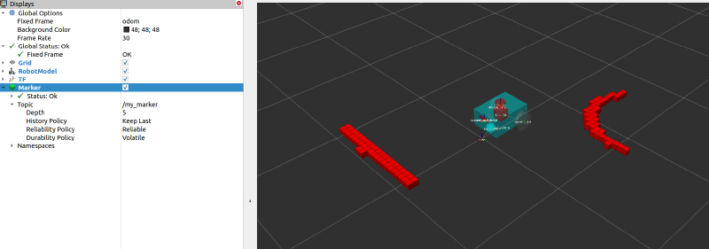
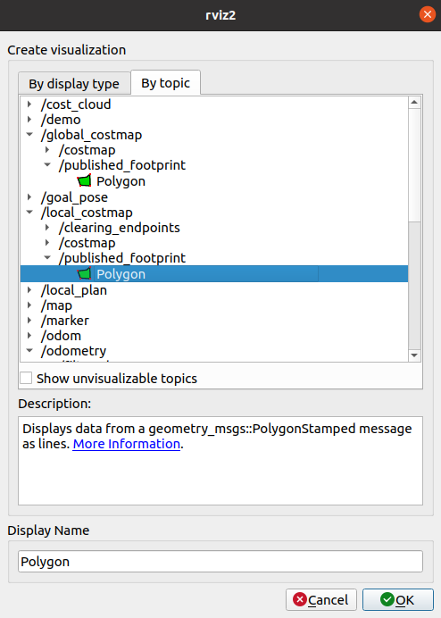
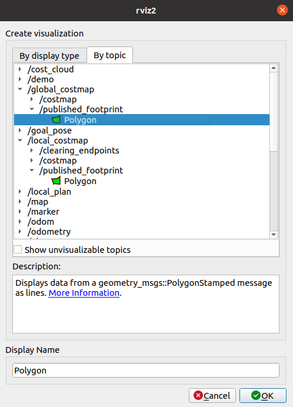

# Navigation 2入门

## 安装与运行示例（以 ROS2 发行版 `humble` 为例）

### 安装

```bash
sudo apt install ros-<ros2-distro>-navigation2
sudo apt install ros-<ros2-distro>-nav2-bringup
sudo apt install ros-<ros2-distro>-turtlebot3*
```

> 以上命令中的 `<ros2-distro>` 请替换为你的发行版（例如 `humble`）。

### 运行示例

```bash
source /opt/ros/<ros2-distro>/setup.bash
export TURTLEBOT3_MODEL=waffle
export GAZEBO_MODEL_PATH=$GAZEBO_MODEL_PATH:/opt/ros/<ros2-distro>/share/turtlebot3_gazebo/models
# 如果 GPU 不可用，可强制软件渲染：
export LIBGL_ALWAYS_SOFTWARE=1
ros2 launch nav2_bringup tb3_simulation_launch.py headless:=False
```

注意：`headless` 默认是 `true`，如需使用 `gzclient` 请设置为 `False`（或 `headless:=False`）。

## 导航相关概念

- TF / TF2
- RViz（可视化）
- Gazebo（3D 仿真）
- URDF（机器人描述）
- SDF（Gazebo 使用的机器人/场景描述）

## 首次机器人配置指南

- 推荐使用启动指令：

```bash
gazebo --verbose -s libgazebo_ros_init.so -s libgazebo_ros_factory.so
```

## 编写机器人

### 1. 设置转换TF2

TF2（Transform Framwork 2）用于管理机器人坐标系之间的变换关系。

### 2. 创建功能包

```bash
ros2 pkg create --build-type ament_cmake sam_bot_description
```

### 3. 编写 URDF（Unified Robot Description Format）

URDF 是 ROS 中描述机器人结构、链接和关节的标准格式。

**安装必要工具：**

```bash
sudo apt install ros-<ros2-distro>-joint-state-publisher-gui
sudo apt install ros-<ros2-distro>-xacro
```

**xacro**：允许在 URDF 中使用变量和宏，简化复杂的机器人描述。

### 4. 编写 SDF（Simulation Description Format）

SDF 是 Gazebo 仿真环境中使用的机器人/环境描述格式。

**安装工具：**

```bash
sudo apt install ros-<ros2-distro>-sdformat-urdf
```

### 5. 设置里程计 - Odometry（Gazebo 仿真）

**安装 3D 模拟器 Gazebo：**

```bash
sudo apt install ros-<ros2-distro>-ros-gz
```

### 6. 实现里程平滑化 - 拓展卡尔曼滤波融合

使用 robot_localization 包融合多个传感器（里程计、IMU 等）以获得平滑的位姿估计。

**安装定位包：**

```bash
sudo apt install ros-<ros2-distro>-robot-localization
```

**编写配置文件 ekf.yaml：**

ekf.yaml 包含 EKF 节点的参数配置，定义输入话题、融合的传感器数据和噪声模型。

### 7. 设置传感器 - Sensors（Gazebo 仿真）

在 Gazebo 中配置机器人传感器：
- **雷达（LiDAR）**：生成环境的点云数据
- **相机**：RGB 或深度相机用于视觉导航


### 8. 制图与定位

#### 8.1 SLAM - Simultaneous Localization and Mapping

**slam_toolbox**：二维同时定位与地图构建工具包

**AMCL**：自适应蒙特卡洛定位工具包

#### 8.2 二维代价地图

**Costmap 2D 软件包**：生成全局和局部代价地图，用于路径规划和碰撞检测。

#### 8.3 运行验证

**步骤 1：启动机器人描述节点**

```bash
colcon build
. install/setup.bash
ros2 launch sam_bot_description display.launch.py
```

**步骤 2：启动 slam_toolbox**

```bash
# 开启新终端
sudo apt install ros-<ros2-distro>-slam-toolbox

# 启动 slam 节点
ros2 launch slam_toolbox online_async_launch.py use_sim_time:=true
```

在 RViz 中查看地图：`Add → Topic → map`

**步骤 3：创建变换树（frame 关系图）**

```bash
ros2 run tf2_tools view_frames
```

生成 `frames.pdf` 显示所有 TF 关系。

**步骤 4：启动 Nav2**

```bash
# 确保已安装 Nav2 软件包
sudo apt install ros-<ros2-distro>-navigation2
sudo apt install ros-<ros2-distro>-nav2-bringup

# 启动 Nav2
ros2 launch nav2_bringup navigation_launch.py use_sim_time:=true
```

#### 8.4 代价地图可视化

**全局代价地图（Global Costmap）：** 基于全局地图的成本栅格

**局部代价地图（Local Costmap）：** 基于机器人周围传感器数据的成本栅格

**可视化体素表示：**

```bash
ros2 run nav2_costmap_2d nav2_costmap_2d_markers voxel_grid:=/local_costmap/voxel_grid visualization_marker:=/my_marker
```

在 RViz 中查看标记：`Add → /mymarker topic → Marker`


### 9. 建立 Footprint（机器人占地面积）

机器人的占地面积定义用于碰撞检测和代价地图膨胀。

**步骤 1：启动机器人描述**

```bash
# 终端 1
colcon build
. install/setup.bash
ros2 launch sam_bot_description display.launch.py
```

**步骤 2：发布静态 TF 变换**

```bash
# 终端 2
ros2 run tf2_ros static_transform_publisher 0 0 0 0 0 0 map odom
```

**步骤 3：启动 Nav2 导航**


```bash
# 终端 3
# 复制配置文件到 config 目录
# 来源：https://github.com/ros-navigation/navigation2_tutorials/blob/humble/sam_bot_description/config/nav2_params.yaml
# 注意：选择与 Ubuntu 版本对应的分支！

ros2 launch nav2_bringup navigation_launch.py params_file:=<full/path/to/config/nav2_params.yaml>
```

**步骤 4：可视化局部代价地图**

在 RViz 中：`Add → LocalCostmap → Add`，固定坐标系为 `odom`，应看到机器人的矩形足迹


**步骤 5：可视化全局代价地图**

在 RViz 中：`Add → GlobalCostmap → Add`，固定坐标系为 `map`，应看到机器人的圆形轮廓


### 10. 设置导航插件

Nav2 支持多种规划器、控制器和行为树插件，可根据需求配置。

### 11. 设置生命周期和组合节点

生命周期管理允许节点在不同的生命周期状态间转换（unconfigured → inactive → active → finalize）。

组合节点将多个功能整合为单个节点，便于管理复杂的系统。

## fishbot 配置

- 两轮差速控制插件示例：


- 键盘控制：

```bash
sudo apt install ros-foxy-teleop-twist-keyboard
ros2 run teleop_twist_keyboard teleop_twist_keyboard
```

- 使用 `rqt` 显示速度（Plugin → Visualization → Plot）


## 导航实战

### Gazebo 仿真环境准备

常用模型下载（示例使用脚本）：

```bash
cd ~/.gazebo && wget https://gitee.com/ohhuo/scripts/raw/master/gazebo_model.py && python3 gazebo_model.py
```

启动时加载世界模型和机器人模型。

## SLAM 建图

### Cartographer

Cartographer 是一个提供 2D 和 3D 同步定位和制图 (SLAM) 的系统，实时生成一致的地图。

#### 安装（只能二选一，不然会冲突，导致链接库有问题）

##### 功能包安装（推荐新手使用）

```bash
sudo apt install ros-humble-cartographer
sudo apt install ros-humble-cartographer-ros
```

##### 源码安装

**下载源码：**

```bash
git clone https://github.com/ros2/cartographer.git -b ros2
git clone https://github.com/ros2/cartographer_ros.git -b ros2
```

**安装依赖：**

一键安装 rosdepc（推荐）：

```bash
wget http://fishros.com/install -O fishros && . fishros  # 选择编号 3
```

> **rosdepc 说明：** 由小鱼制作的国内版 rosdep，是一个用于安装依赖的工具。一键安装完成后，运行一次 `rosdepc update` 即可使用。

```bash
rosdepc update
rosdepc install -r --from-paths src --ignore-src --rosdistro $ROS_DISTRO -y
```

**编译：**

```bash
colcon build --packages-up-to cartographer_ros
```

> **提示：** `--packages-up-to` 选项表示编译该包及其所有依赖包。

#### 测试是否安装成功

```bash
ros2 pkg list | grep cartographer
```

如果输出中包含 `cartographer` 和 `cartographer_ros`，说明安装成功。

#### Carto 参数配置

##### 基本介绍

Cartographer 的参数配置主要通过 `.lua` 配置文件进行。关键参数包括：


#### 配置 fishbot 进行建图

**建图流程：**

1. **启动机器人和 Gazebo 仿真**
2. **启动 Cartographer 建图节点**
3. **控制机器人移动，生成地图**
4. **保存建图结果**

示例启动命令：

```bash
# 终端 1：启动仿真
ros2 launch fishbot_simulation ... (根据实际启动文件)

# 终端 2：启动 Cartographer
ros2 launch cartographer_ros carto_cartographer.launch.py
```

#### 地图加载与编辑

##### 1. 下载和安装 GIMP

```bash
sudo apt install -y gimp language-pack-gnome-zh-hant language-pack-gnome-zh-hans
```

##### 2. 编辑地图

- 打开 GIMP，加载建图生成的地图图像
- 使用 GIMP 的绘画和编辑工具修正地图中的错误
- 清除噪点和伪影
- 完成编辑后导出为 **PNG 格式** 到 map 路径下

**导出设置：**
- 格式：PNG
- 保存路径：通常为 ROS 工作空间下的 `maps/` 目录
- 文件名例：`fishbot_map.png`

##### 3. 修改配置文件

在 map 路径下创建对应的 YAML 配置文件 `fishbot_map.yaml`：

> **参数说明：**
> - `image`：地图图像文件名
> - `resolution`：地图分辨率（米/像素）
> - `origin`：地图原点在世界坐标系中的位置 [x, y, theta]
> - `occupied_thresh` / `free_thresh`：栅格占用/自由的阈值

##### 4. 启动地图服务和导航

**终端 1：启动地图服务器**

```bash
ros2 run nav2_map_server map_server --ros-args --param yaml_filename:=fishbot_map.yaml
```

**终端 2：启动 RViz2 可视化**

```bash
rviz2
```

配置 RViz：
- 添加 Map 话题（Topic → map）
- 设置固定坐标系为 map

**终端 3：激活地图服务器生命周期**

```bash
ros2 lifecycle set /map_server configure
ros2 lifecycle set /map_server activate
```

> **生命周期说明：**
> - `configure`：配置节点，加载地图文件
> - `activate`：激活节点，开始发布地图

##### 5. 验证结果

- 在 RViz2 中应看到加载的地图显示

- 如有多个终端，需检查话题连接是否正常

```bash
ros2 topic list | grep map
```

应输出类似：
```bash
/map
/map_metadata
```

**常见问题排查：**

| 问题 | 解决方案 |
|------|--------|
| 地图加载失败 | 检查 YAML 文件路径和 PNG 图像文件是否存在 |
| 话题无数据 | 确保 map_server 已激活（lifecycle set activate） |
| RViz 无显示 | 检查坐标系设置，确保 TF 变换正确 |
| 分辨率不对 | 调整 YAML 中的 `resolution` 参数以匹配建图时的设置 |

## Nav2 导航

APT 安装示例：

```bash
sudo apt install ros-humble-nav2-*
```

测试是否安装成功：

```bash
ros2 pkg list | grep navigation2
```

源码功能包拆解列表：


为 fishbot 配置 Nav2 示例：

```bash
ros2 pkg create fishbot_navigation2 --dependencies nav2_bringup
```


## 运行官方示例

- 运行 `nav_to_pose_example_launch.py` 等教程示例。

## 常用节点

- 键盘操控节点：

```bash
ros2 run teleop_twist_keyboard teleop_twist_keyboard
```

## 杂项

- 在当前虚拟环境中打开 `rqt`（避免依赖问题）：

```bash
python -m rqt_gui.main
```

- colcon 构建时忽略指定文件夹（示例）：

```bash
touch py_venv/COLCON_IGNORE
```

- 关闭 Gazebo 与 RViz2 建议流程：`File → Quit`；如遇无法启动仿真，可尝试：

```bash
wsl --shutdown
# 然后重启 WSL
```

## 参考

- navigation2_tutorials 示例：
	- https://github.com/ros-planning/navigation2_tutorials/tree/master/sam_bot_description
- FishROS 教程（humble）：
	- https://fishros.com/d2lros2/#/humble
- FishROS Nav2 中文文档：
	- http://dev.nav2.fishros.com
- Nav2 官方文档：
	- https://docs.nav2.org/
- ROS 2 URDF 指南：
	- https://docs.ros.org/en/humble/Tutorials/Intermediate/URDF/Building-a-Visual-Robot-Model-with-URDF-from-Scratch.html

---

*笔记由导出的 HTML 转换并整理，若需调整标题层级或把部分内容拆分为子页面，请告诉我。*