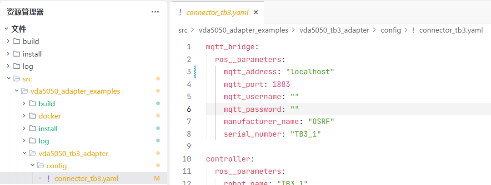

# VDA5050_tb3_Nav2测试运行流程

本文档介绍如何在 Nav2 仿真环境中运行 VDA5050 接口的 TurtleBot3 机器人。

---

## 1. 克隆仓库

```bash
mkdir -p vda5050_nav2_ws/src	#创建项目工作空间
cd vda5050_nav2_ws/src
git clone https://github.com/inorbit-ai/vda5050_adapter_examples.git
git clone https://github.com/inorbit-ai/ros_amr_interop.git
#克隆后把其中的vda5050_connector、vda5050_msgs、vda5050_serializer挪到src目录下，之后可删掉ros_amr_interop

```

---

## 2. 环境准备

确保已修复 NumPy 2.0 兼容性问题：

```bash
python3 -m venv .venv		#建议先创建py虚拟环境
source .venv/bin/activate   	#激活虚拟环境
pip install "numpy<2.0"
```

---

## 3. 修改配置文件

在启动 VDA5050 适配器前，需要修改配置文件中的 MQTT 地址：

```bash
cd vda5050_adapter_examples/vda5050_tb3_adapter/config
vim connector.yaml
```

修改 `mqtt_address` 为你的 MQTT 服务器地址（如果是本机则保持默认）：

```yaml
mqtt_address: "localhost"
```

---

## 4. 准备构建目录

```bash
#进入ros_amr_interop目录
colcon build
```

---

## 5. 运行步骤 (多终端顺序执行)

### 终端 1: 启动 MQTT 代理 (Docker)

>先将下图中的mqtt_address修改成localhost（与mqtt_broker中匹配）


```bash
cd src/vda5050_adapter_examples/docker
docker run --rm --network host --name mosquitto eclipse-mosquitto
```

### 终端 2: 启动 Nav2 仿真 (TurtleBot3 Simulation)

```bash
export TURTLEBOT3_MODEL=waffle
source /opt/ros/humble/setup.bash
source install/setup.bash
ros2 launch nav2_bringup tb3_simulation_launch.py headless:=False
```

### 终端 3: 启动 VDA5050 TB3 连接器

```bash
source /opt/ros/humble/setup.bash
source install/setup.bash
ros2 launch vda5050_tb3_adapter connector_tb3.launch.py
```

### 终端 4: 设定机器人初始位姿 (关键)

由于这是标准的 ROS2 话题，通常只需要 `source` ROS2 基础环境即可。如果该命令报错，请加上 `source install/setup.bash`。

```bash
source /opt/ros/humble/setup.bash
source install/setup.bash	#不source，话题发不出去
ros2 topic pub -1 --qos-reliability reliable /initialpose geometry_msgs/PoseWithCovarianceStamped \
   "{header: {frame_id: map}, pose: {pose: {position: {x: -2.1, y: -0.5, z: 0.0}, orientation: {x: 0.0, y: 0.0, z: 0, w: 1.0000000}}, covariance: [0.25, 0.0, 0.0, 0.0, 0.0, 0.0, 0.0, 0.25, 0.0, 0.0, 0.0, 0.0, 0.0, 0.0, 0.0, 0.0, 0.0, 0.0, 0.0, 0.0, 0.0, 0.0, 0.0, 0.0, 0.0, 0.0, 0.0, 0.0, 0.0, 0.0, 0.0, 0.0, 0.0, 0.0, 0.0, 0.06853891945200942]}}"
```

> 注意：初始位姿设定是让机器人能够进行导航的关键步骤。发布 `initialpose` 后，机器人在 Gazebo 中会定位到地图的正确位置。

---

## 6. 发送测试订单 (MQTT)

当机器人在 Gazebo 中定位成功（`initialpose` 发布后机器人会出现在地图正确位置）后，发送目标点：

### 方式一：命令行发送

**第一个订单：order_1**

```bash
mosquitto_pub -h localhost -p 1883 -t uagv/v2/OSRF/TB3_1/order -m '
{
    "orderId": "order_1",
    "orderUpdateId": 0,
    "version": "2.0.0",
    "manufacturer": "OSRF",
    "serialNumber": "TB3_1",
    "nodes": [
        {
            "nodeId": "node1",
            "released": true,
            "sequenceId": 0,
            "nodePosition": {
                "x": 2.0,
                "y": 0.95,
                "theta": -0.66,
                "mapId": "map"
            },
            "actions": []
        },
        {
            "nodeId": "node2",
            "released": true,
            "sequenceId": 2,
            "nodePosition": {
                "x": 1.18,
                "y": -1.76,
                "theta": 0.0,
                "mapId": "map"
            },
            "actions": []
        },
        {
            "nodeId": "node3",
            "released": true,
            "sequenceId": 4,
            "nodePosition": {
                "x": -0.38,
                "y": 1.89,
                "theta": 0.0,
                "mapId": "map"
            },
            "actions": []
        },
        {
            "nodeId": "node4",
            "released": true,
            "sequenceId": 6,
            "nodePosition": {
                "x": -0.17,
                "y": 1.74,
                "theta": -2.6,
                "mapId": "map"
            },
            "actions": []
        },
        {
            "nodeId": "node1",
            "released": true,
            "sequenceId": 8,
            "nodePosition": {
                "x": 2.0,
                "y": 0.95,
                "theta": -0.66,
                "mapId": "map"
            },
            "actions": []
        }
    ],
    "edges": [
        {
            "edgeId": "edge1",
            "released": true,
            "sequenceId": 1,
            "startNodeId": "node1",
            "endNodeId": "node2",
            "actions": []
        },
        {
            "edgeId": "edge2",
            "released": true,
            "sequenceId": 3,
            "startNodeId": "node2",
            "endNodeId": "node3",
            "actions": []
        },
        {
            "edgeId": "edge3",
            "released": true,
            "sequenceId": 5,
            "startNodeId": "node3",
            "endNodeId": "node4",
            "actions": []
        },
        {
            "edgeId": "edge4",
            "released": true,
            "sequenceId": 7,
            "startNodeId": "node4",
            "endNodeId": "node1",
            "actions": []
        }
    ]
}
'
```

**第二个订单：order_2**

```bash
mosquitto_pub -h mosquitto -p 1883 -t uagv/v2/OSRF/TB3_1/order -m '
{
  "orderId": "order_2",
  "orderUpdateId": 0,
  "version": "2.0.0",
  "manufacturer": "OSRF",
  "serialNumber": "TB3_1",
  "nodes": [
    {
      "nodeId": "node1",
      "released": true,
      "sequenceId": 0,
      "nodePosition": {
        "x": 2,
        "y": 0.95,
        "theta": -0.66,
        "mapId": "map"
      },
      "actions": []
    },
    {
      "nodeId": "node2",
      "released": true,
      "sequenceId": 2,
      "nodePosition": {
        "x": 1.18,
        "y": -1.76,
        "theta": 0,
        "mapId": "map"
      },
      "actions": [
        {
          "actionType": "beep",
          "actionId": "a1",
          "actionDescription": "Make a beep noise on node",
          "blockingType": "NONE",
          "actionParameters": []
        }
      ]
    },
    {
      "nodeId": "node3",
      "released": true,
      "sequenceId": 4,
      "nodePosition": {
        "x": -0.38,
        "y": 1.89,
        "theta": 0,
        "mapId": "map"
      },
      "actions": [
        {
          "actionType": "beep",
          "actionId": "a2",
          "actionDescription": "Make a beep noise on node",
          "blockingType": "NONE",
          "actionParameters": []
        }
      ]
    },
    {
      "nodeId": "node4",
      "released": true,
      "sequenceId": 6,
      "nodePosition": {
        "x": -0.17,
        "y": 1.74,
        "theta": -2.6,
        "mapId": "map"
      },
      "actions": [
        {
          "actionType": "beep",
          "actionId": "a3",
          "actionDescription": "Make a beep noise on node",
          "blockingType": "NONE",
          "actionParameters": []
        }
      ]
    },
    {
      "nodeId": "node1",
      "released": true,
      "sequenceId": 8,
      "nodePosition": {
        "x": 2,
        "y": 0.95,
        "theta": -0.66,
        "mapId": "map"
      },
      "actions": [
        {
          "actionType": "beep",
          "actionId": "a4",
          "actionDescription": "Make a beep noise on node",
          "blockingType": "NONE",
          "actionParameters": []
        }
      ]
    }
  ],
  "edges": [
    {
      "edgeId": "edge1",
      "released": true,
      "sequenceId": 1,
      "startNodeId": "node1",
      "endNodeId": "node2",
      "actions": []
    },
    {
      "edgeId": "edge2",
      "released": true,
      "sequenceId": 3,
      "startNodeId": "node2",
      "endNodeId": "node3",
      "actions": []
    },
    {
      "edgeId": "edge3",
      "released": true,
      "sequenceId": 5,
      "startNodeId": "node3",
      "endNodeId": "node4",
      "actions": []
    },
    {
      "edgeId": "edge4",
      "released": true,
      "sequenceId": 7,
      "startNodeId": "node4",
      "endNodeId": "node1",
      "actions": []
    }
  ]
}
'
```

### 方式二：MQTT Explorer（可视化工具）

推荐使用 MQTT Explorer 进行可视化接收和发布：

1. 下载安装：
2. 配置连接：

   - Host: `localhost`
   - Port: `18883`
3. 订阅话题：接收机器人状态

   - 订阅 `uagv/v2/OSRF/TB3_1/state`
4. 发布话题：发送订单

   - 发布到 `uagv/v2/OSRF/TB3_1/order`
   - 粘贴上面的 JSON 内容

> MQTT Explorer 可以实时查看话题消息，方便调试。

---

## 7. 核心设计说明：v1 与 v2 版本解惑

您可能会观察到一个现象：**外部 MQTT 通信使用 `v2` 版本，而内部 `ros2 topic list` 查看到的却是 `v1` 版本**。这是符合当前项目设计的，并非 Bug。

`mqtt_bridge` 节点在此处扮演了“协议翻译官”的角色，它解耦了外部 VDA5050 协议版本和内部 ROS 节点间的通信。

### 为什么 MQTT 必须用 `v2`？

- `mqtt_bridge` 节点启动时，会读取 `vda5050_protocol_version` 这个 ROS 参数，其**默认值为 "2.0.0"**。
- 代码会从 "2.0.0" 中提取出主版本号 `2`，并生成别名 **`v2`**。
- `mqtt_bridge` 使用这个 `v2` 别名来**监听和发布所有外部的 MQTT 主题**。
- 因此，您发送的 `order` 命令必须使用 `uagv/v2/...` 格式才能被正确接收。

### 为什么 `ros2 topic` 查到的是 `v1`？

- 当 `mqtt_bridge` 接收到 `v2` 的 MQTT 订单后，需要将其转发给内部的 ROS 系统（如 `vda5050_controller` 节点）。
- 在构造内部 ROS 主题时，代码的实现**默认使用了 `v1`** 作为版本号。
- 这个逻辑可以在 `vda5050_connector_py/utils.py` 的 `get_ros_topic_name` 函数中找到，其 `major_version` 参数默认为 `"v1"`。
- 因此，`ros2 topic list` 显示的是内部 ROS 通信使用的主题，即 `/uagv/v1/OSRF/TB3_1/order`。

### 总结

| 方向 | 协议 | 版本 | 示例主题 |
| :--- | :--- | :--- | :--- |
| **外部 -> 内部** (接收指令) | MQTT | **v2** | `uagv/v2/OSRF/TB3_1/order` |
| **内部 -> 内部** (ROS节点间) | ROS | **v1** | `/uagv/v1/OSRF/TB3_1/order` |
| **内部 -> 外部** (发送状态) | ROS -> MQTT | `v1` -> `v2` | 内部 `/v1/state` 消息被转换为 `uagv/v2/.../state` |

> **结论：与 MQTT 交互用 `v2`，用 `ros2` 工具查看话题用 `v1`**。

---

## 订单更新规则

发送订单时需遵守以下规则：

1. **新订单**：orderId 不能与之前重复
2. **订单更新**：同一个 orderId 可以发送更新订单，**第一个 nodeId 必须与之前最后一个 nodeId 一致**
3. **新动作**：actionId 不能重复

---

### VDA5050 订单更新（Order Update）节点匹配要求

当发送 `orderUpdateId > 0` 的更新订单时，**新订单的第一个节点必须与当前订单最后一个节点完全一致**，否则会被拒绝（即使 `nodeId` 相同）。

#### 必须一致的字段

| 字段                   | 说明                    |
| ---------------------- | ----------------------- |
| `nodeId`             | 节点ID                  |
| `sequenceId`         | 顺序号                  |
| `nodePosition.x`     | X坐标                   |
| `nodePosition.y`     | Y坐标                   |
| `nodePosition.theta` | 角度                    |
| `mapId`              | 地图ID                  |
| `actions`            | 动作数量及每个 actionId |

#### 示例

**原始订单结尾节点**：

```json
{
  "nodeId": "node1",
  "sequenceId": 8,
  "nodePosition": { "x": 2.0, "y": 0.95, "theta": -0.66, "mapId": "map" },
  "actions": [{ "actionType": "beep", "actionId": "xxx", ... }]
}
```

**合法更新订单首节点**：

```json
{
  "nodeId": "node1",
  "sequenceId": 8,
  "nodePosition": { "x": 2.0, "y": 0.95, "theta": -0.66, "mapId": "map" },
  "actions": [{ "actionType": "beep", "actionId": "yyy", ... }]
}
```

> 注意：
>
> - `theta` 错误（如误用 `-2.6`）或 `actions` 数量不一致是常见拒因
> - 建议使用真实 UUID 生成 `actionId`，避免状态机卡死
> - 若已卡住，重启控制器最有效

| 步骤            | 说明                               |
| --------------- | ---------------------------------- |
| 1. 克隆仓库     | 克隆 vda5050_adapter_examples 仓库 |
| 2. 环境准备     | 安装兼容版本的 NumPy               |
| 3. 修改配置文件 | 修改 MQTT 地址                     |
| 4. 构建项目     | 创建目录结构并编译                 |
| 5. 启动 MQTT    | Docker 运行 Mosquitto 代理         |
| 6. 启动仿真     | Nav2 + TurtleBot3 Gazebo 仿真      |
| 7. 启动适配器   | VDA5050 TB3 连接器                 |
| 8. 设定初始位姿 | 发布 `/initialpose` 话题         |
| 9. 发送订单     | 通过 MQTT 下发任务                 |

这样整个流程就闭环了：**克隆仓库 -> 环境准备 -> 修改配置 -> 构建项目 -> 基础组件启动 -> 仿真定位 -> VDA5050 任务下发**。
